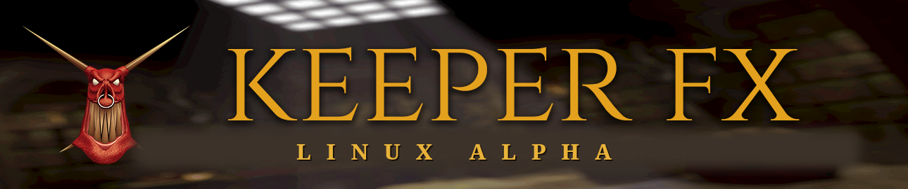

# KeeperFX — Tux Edition

*The native Linux build of KeeperFX — built for penguins. 🐧 &nbsp;Unofficial, community-maintained, and continuously re-synced with the upstream team's work. (Alpha.)*



[](https://github.com/dkfans/keeperfx)


**Dungeon Keeper, native on Linux.** One file on most distros — a proper source-built package on Arch.

## ▶ Download &amp; play

### **[⬇ KeeperFX-Linux-Alpha-x86_64.AppImage](https://github.com/ForkedInTime/keeperfx-linux-alpha/releases/latest/download/KeeperFX-Linux-Alpha-x86_64.AppImage)** &nbsp;·&nbsp; ~500 MB &nbsp;·&nbsp; any current 64-bit Linux

<sub>↳ The link above always grabs the newest build. To see every version, the changelogs, or an older build, browse **[all releases »](https://github.com/ForkedInTime/keeperfx-linux-alpha/releases)**.</sub>

```bash
chmod +x KeeperFX-Linux-Alpha-x86_64.AppImage
./KeeperFX-Linux-Alpha-x86_64.AppImage
```

That **one file** has everything — launcher, engine, every library, and the game data. Nothing to `apt install`.
It opens the settings launcher, finds your *Dungeon Keeper* install, lets you set up graphics/sound, and plays.

🔑 **The only thing you provide is your own original *Dungeon Keeper* files** — from
[GOG](https://www.gog.com/game/dungeon_keeper),
[Steam](https://store.steampowered.com/app/1996630/Dungeon_Keeper_Gold/),
[EA](https://www.ea.com/games/dungeon-keeper/dungeon-keeper), or an old CD. The launcher copies them for you.
(We never ship the original game — you must own it.)

> 🐧 **No GOG Galaxy on Linux?** There's no native GOG client — so see
> **[How do I install DK1 on Linux?](#how-do-i-install-dk1-on-linux)** for getting your GOG/Steam/EA
> copy installed (via Lutris or Heroic) so the launcher can find it.

Runs on any current 64-bit distro — Ubuntu 24.04 / 26.x, Fedora, Arch, Steam Deck, … &nbsp;
*(not Ubuntu 22.04 or older — see [requirements](#system-requirements)).*

<details>
<summary><b>Won't start?</b> (a <code>libfuse.so.2</code> error)</summary>

> Modern distros ship FUSE 3, but AppImages want FUSE 2 to mount themselves. Either:
> - run it without FUSE: `./KeeperFX-Linux-Alpha-x86_64.AppImage --appimage-extract-and-run`, or
> - install the small shim once: `sudo apt install libfuse2t64` (Ubuntu/Debian) / the `fuse2` package elsewhere.
>
> That's the AppImage *runtime*, not our app — everything our game needs is already bundled.
</details>

## 🏛 Arch Linux — a proper package

**Arch, CachyOS, EndeavourOS, Manjaro:** there's a proper package. No blob to download, no `chmod +x` —
the engine is compiled from source against your system's own libraries.

```bash
git clone https://github.com/ForkedInTime/keeperfx-linux-alpha.git
cd keeperfx-linux-alpha/packaging/aur && makepkg -si
```

> ⏳ **Not on the AUR yet — `yay -S keeperfx-tux` will not find it.** The recipe is finished and verified in
> a clean chroot; what is missing is the upload. The Arch team
> [disabled pushes to the AUR on 1 August 2026](https://lists.archlinux.org/archives/list/aur-general@lists.archlinux.org/message/YPJ3FQYJTJXXY3RUXCYLMHUKHLIUNVFF/)
> while they deal with a wave of malicious package takeovers, so nobody can submit anything at the moment.
> It goes up when they reopen. The two commands above work today and produce the same package.

Then launch **KeeperFX (Tux Edition)** from your menu, or run `keeperfx-tux`. Re-run those two commands to
update — no self-updater, no re-downloading half a gigabyte. Once the package is on the AUR, `yay -Syu`
will keep it current along with everything else.

That is the whole install: it builds the engine on your machine and pulls in
`keeperfx-tux-data` (the campaigns, graphics and sounds) automatically.

<details>
<summary><b>What the package does and doesn't include</b></summary>

> It installs as two pieces from one recipe: `keeperfx-tux`, the engine, compiled against your system's
> SDL2/ffmpeg/OpenAL rather than bundling copies; and `keeperfx-tux-data`, everything KeeperFX itself
> provides — campaigns, graphics, sounds and language files. You only ever ask for the first; pacman
> brings the second.
>
> On first launch the game directory is assembled at `~/.local/share/keeperfx-alpha` (set `KEEPERFX_HOME`
> to put it elsewhere). **You still need to own the original game**, same as every other install method
> here: 14 files from your *Dungeon Keeper* CD or GOG/Steam/EA copy are not redistributable, so they are
> not in any package. If they are missing the game names them exactly and stops, and the Qt launcher can
> find an installation and copy them for you.
>
> The recipe lives in `packaging/aur/` in this repository, so what you build with `makepkg` above is
> exactly what will be published to the AUR — same PKGBUILD, same two packages, same paths.

</details>

<details>
<summary><b>Prefer Flatpak?</b> &nbsp;(AppImage vs Flatpak — which should I pick?)</summary>

> Both contain the same game; they're just two ways to install it.
>
> - **AppImage — recommended.** The simplest: download one file, make it runnable, go. Nothing is installed
>   into your system, and you can delete it any time. Best if you just want to play.
> - **Flatpak.** Pick this if you already use Flatpak and want KeeperFX in your app menu with automatic
>   updates. It needs Flatpak set up first and downloads a shared system runtime the first time (a few hundred
>   MB, reused by your other Flatpaks). It's newer and less-tested for this game, so if anything misbehaves,
>   use the AppImage. Grab `KeeperFX-Linux-Alpha-x86_64.flatpak` from
>   [Releases](https://github.com/ForkedInTime/keeperfx-linux-alpha/releases) and:
>   `flatpak install --user ./KeeperFX-Linux-Alpha-x86_64.flatpak`
>   *(The Flatpak is rebuilt monthly, so it may sit on a slightly older release than the AppImage —
>   no matter: it self-updates the game package on launch.)*
>
> **Short version: use the AppImage unless you specifically want Flatpak.**
</details>

> ⚠️ *Unofficial personal alpha — **not** affiliated with the KeeperFX team. Please don't report issues from
> this fork upstream. The game itself is [their work](#credit). Prefer to compile it yourself, or want the
> details? Read on.*

---

<sub>Everything below is detail — you don't need it to play.</sub>

## Credit

**KeeperFX is the work of the KeeperFX team and the Keeper Klan community**, built up over many years: the
complete decompilation-and-rewrite of *Dungeon Keeper* into modern code, the gameplay, the tooling — **and the
native Linux support this edition stands on.** The overwhelming majority of everything you run here is
theirs. This repository is a thin layer of personal tweaks on top of their `master`, re-synced with their
latest **weekly** (see [how](#how-the-tux-edition-stays-current-with-upstream)). All the real progress comes from them.

- **Upstream / source of truth:** https://github.com/dkfans/keeperfx
- **Website:** https://keeperfx.net
- **Community (Keeper Klan Discord):** https://discord.gg/hE4p7vy2Hb

If you enjoy this, support **the upstream project** — that's where the game is actually made.

## What the Tux Edition adds on top of upstream

**Upstream supports Linux — as source code.** `linux.mk` is theirs and it works; you can compile KeeperFX
on Linux today. What you can't do is *download* it. Their release pipeline cross-compiles to Windows with
MinGW, and every release from 2024 to the current **v1.4.0** ships exactly one file:
`keeperfx_1_4_0_complete.7z`, a Windows package. There is no Linux build, no installer, no launcher — the
Linux path ends at a compiler.

**This edition is that missing half, and only that half.** Every week a bot merges the team's latest
`master` here, compile-checks it and opens a pull request, so the *game* is theirs and stays current —
never a stale snapshot frozen at whatever built cleanly once. On top of it sits the part nobody else
maintains: a ready-to-run **AppImage, Flatpak and Arch package**, a native Qt launcher that doesn't touch
Wine, and the Linux-specific fixes, hardening and performance work below.

> **At a glance — everything here is a curated Linux layer, not a rewrite of the game.** We don't chase
> upstream's headline count; the team ships the *game*, and our job is the platform work they don't do.
> That layer is real, and every line of it is traceable to a commit in this repo:
>
> | | What we added | Roughly |
> |---|---|---|
> | 🐧 | **Ready-to-run Linux builds** — one-file AppImage, Flatpak, and an Arch/AUR package, plus the native Qt launcher (upstream ships source only — no Linux binary in any release) | the whole platform |
> | 🛡️ | **Correctness & security hardening** — a multi-agent Linux audit: out-of-bounds writes from crafted maps/mods, union byte-aliasing, format-string bugs | ~29 fixes |
> | 💥 | **Crash fixes** — ultrawide creature-possession, UTF-8 fonts, campaign scripts, clean exit, case-sensitive audio, creature-list corruption guard | ~6 fixes |
> | ⚡ | **Performance** — frame pacing matched to your monitor, cached parchment map view, GPU palette re-upload, per-turn CPU busy-spin, sprite/text blit, GUI hot paths, cached instant-load Workshop | 9 wins |
> | 🎨 | **Graphics & audio** — GPU OpenGL 3.3 present layer, truecolor movie playback, your own music in any filenames and any of OGG/FLAC/WAV/MP3, a real window icon and desktop identity on X11 *and* Wayland | 4 items |
> | 🌐 | **Multiplayer map packs** — the Classic, Modern and Original mappacks now load in every install method | 1 fix |
> | 🧰 | **Launcher & tooling** — in-launcher Workshop browser + Installed manager, Mod Manager, Play ▾ menu, built-in updater, music download + recovery, single-instance lock, weekly sync bot | 10+ items |
>
> <sub>Count it yourself: `git log --oneline --no-merges upstream/master..HEAD` — 123 commits of ours on top
> of theirs, on top of 9 weekly upstream merges. The sections below are the line items.</sub>

<details>
<summary><b>📋 Full breakdown — every change, area by area</b> &nbsp;<sub>(click to expand)</sub></summary>
<br>

**Display & media**
- **GPU-accelerated display (OpenGL 3.3).** The game's 8-bit paletted frame is uploaded to the GPU and
  palette-mapped in a shader instead of being blitted on the CPU, then hardware-scaled to your screen
  (great on a 3440×1440 ultrawide). Upstream is still 100% software, even on Linux. This layer is also the
  foundation for the truecolor 3D renderer below.
- **Truecolor front-end movies.** The intro, logo stings and outro can play in full color through the GPU
  (any codec, not just 8-bit Smacker), plus a no-AI "vintage cleanup" of all five movies that keeps the
  original 80s-CG character while removing blocking/banding on a big screen.
- **Your own music — any filenames, any format.** Upstream demands exactly `keeper02.ogg` … `keeper07.ogg`
  and plays nothing otherwise. Here the game uses whatever audio is in `music/`: name the files what you
  like (`Track 02.flac`, `02.wav`, or the original names) in **OGG, FLAC, WAV or MP3**. Files carrying a
  track number are placed by it; the rest are used in alphabetical order. Existing installs are untouched —
  `keeperNN` names are still looked up first and still win. And when something doesn't play, `keeperfx.log`
  now names every file the game skipped and why, instead of failing silently.
- **A real window icon and desktop identity.** The game window came up with a generic placeholder icon in
  the taskbar and dock. It now sets its own icon *and* a matching desktop entry — Wayland ignores the icon
  a window asks for and instead matches the window's app ID to an installed `.desktop` file, so both halves
  are needed for the icon to actually appear. Fixed for X11 and Wayland alike, in every install method.

**Native Linux launcher** *(the KeeperFX team's `keeperfx-launcher-qt`, made to run natively)*
- The team's Qt settings launcher compiles cross-platform but was written Windows-first (it launched the game
  through **Wine** and read the version from a Windows `.exe`). Here it's built for Linux and patched to detect
  and launch the **native** engine directly — **no Wine** — read the real version, and expose all of its
  Graphics / Sound / Input settings.
- **Built-in updates.** The launcher checks *this* repo's releases and shows **"Update available — vX"** when a
  newer build is out; one click downloads just the updated game package (no need to re-download the whole
  AppImage). It notifies — it never auto-overwrites.
- **One-click mods, campaigns & map packs.** A Mod Manager with an **Install…** button takes a `.7z`/`.zip`
  (e.g. a [keeperfx.net workshop](https://keeperfx.net/workshop) download) and drops it into the right place —
  mods into `mods/`, campaigns into `campgns/`, map packs into `levels/` — generating a `mod.cfg` if the
  archive lacks one. Mods get an Enabled toggle that writes the load order for you.
- **Browse & install from the Workshop, in the launcher.** A **Browse Workshop** button opens the full
  [keeperfx.net workshop](https://keeperfx.net/workshop) catalogue *inside* the launcher — search, filter by
  category, sort by rating / downloads, thumbnails, and a **Details** link to each item's page — and **install
  with one click** (maps, campaigns, map packs and mods each land in the right place — including standalone
  single maps, and VCS/OS junk like `.git` is stripped from archives). It sorts by rating / downloads /
  newest and marks what you already have. An **Installed** tab scans what you have, labels each add-on as
  KeeperFX-stock or Workshop/user, and lets you **uninstall reversibly** — removed items go to a backup you
  can **Restore** in one click. And it **loads instantly on re-open**: thumbnails and the catalogue are
  cached to disk and refreshed in the background, so there's no "is it stuck?" wait after the first visit.
- **One launcher at a time.** The launcher won't open a second copy of itself (that would let two games fight
  over the same saves).
- **Accessibility — launcher size.** Scale the whole launcher UI (100 %, 110 %, 125 % … up to 200 %) for
  readability.

**Linux performance** *(engine-level optimizations specific to this native build — upstream is Windows-first and does not tune the GCC/Linux path, so these are ours)*
- **Frame pacing matched to your monitor.** The shipped default draws as fast as the processor allows —
  frames your display never shows, one core pinned at 100%, and, because the game runs on a single thread,
  nothing held in reserve for a frame that needs extra work. Such a frame overruns and is dropped: an
  intermittent stutter with no single cause. New installs now cap drawing at the refresh rate the display
  reports, and when the machine can't hold that rate the cap steps down to a whole fraction of it
  (144 → 72 → 48) so a frame that would have been dropped arrives on time instead. It has hysteresis in
  both directions, so it settles rather than hunts. A rate you set yourself is an instruction and is never
  overridden, and the simulation is untouched — multiplayer and replays advance at their own pace no matter
  how often the screen is drawn.
- **The map view no longer costs a processor core.** With the map open, 46% of all CPU time went on
  stretching the parchment background to fill the screen — about five million pixels at 3440×1440, every
  frame, on the one thread the game loop runs on — only to discard it and start over. The image is static.
  It's now scaled once and kept, rebuilt only when the screen size, scale, map geometry or the image itself
  actually changes. The cost scaled with screen area, so the wider your display the more this gives back.
- **No redundant GPU palette re-upload.** The OpenGL present path re-uploaded the 256-colour palette every
  frame — a CPU expansion, a texture upload, and a driver sync — even though it changes only on fades,
  flashes and movies. It's now guarded so it uploads only when the palette actually changes.
- **No per-turn CPU busy-spin.** The turn pacer busy-spun the tail of *every* game turn (a leftover Windows
  timer workaround), continuously burning a few percent of a CPU core and hurting laptop battery and
  thermals. The Linux path now sleeps precisely with a high-resolution monotonic timer — zero spin.
- **Faster sprite/text blit.** The core sprite- and glyph-drawing copy is now a single `memcpy` on its hot
  path (which the C library vectorizes with SIMD at runtime) instead of a byte-at-a-time loop through a
  double pointer.

These were found by a multi-agent Linux performance audit, are output-identical to the original, and are
verified in-game. (Two classes of change are deliberately held back: ones that would break
save/multiplayer/replay compatibility — the oversized core sim structs, combat target-search scaling — until
they can be proven safe under replay testing; and a wider `-march=x86-64-v2` build, which was tried and
reverted because GCC's auto-vectorizer miscompiles a loop in the 25-year-old pathfinding code. Correctness
first.)

**Stability & security fixes** *(genuine upstream bugs fixed locally, plus faults in this fork's own Linux layer; the security ones reported upstream)*
- **Files that came along for the ride are no longer treated as content.** Archives built on macOS or
  Windows carry a small hidden companion file beside every real one, and campaigns, mods and map packs
  reach a Linux install as archives. This fork's own directory scanner handed those companions to the game
  as content: it read them as campaigns, passed them to the graphics loader, counted them as levels, and
  told you on screen to install one as a mod. They also sort ahead of the file they shadow, so anything
  choosing by position chose the wrong one. Hidden files are now ignored everywhere the game looks for
  content, and the scanner has tests that run it against a real directory.
- **Creature-list corruption guard** — a corrupted creature-list link (a "next" pointer aimed at a slot
  that isn't a creature) could abort the whole game when advancing between campaign levels. The engine now
  validates each creature in a list before using it across ~18 walks that previously lacked the check,
  logging rich diagnostics and **safely skipping instead of crashing** — the game keeps playing. This bug
  exists upstream too; ours degrades gracefully and leaves a breadcrumb toward a permanent root fix.
- **Clean exit on quit** — avoids a shutdown segfault caused by the SDL3/Wayland teardown race on systems
  using `sdl2-compat`.
- **Ultrawide creature-possession crash** — the new C++ lens effect didn't size its buffer for large
  horizontal viewports; possessing a creature at 3440×1440 read past the buffer.
- **UTF-8 font heap-crash** — the new UTF-8 font loader freed a pointer into a *static* buffer, aborting on
  glibc the moment the generated `.fxfont` files exist.
- **Campaign crash on level start** — the `QUICK_MESSAGE`/`DISPLAY_MESSAGE` script commands corrupted the
  message index when given a chat-icon argument (a `ScriptValue` union overlap on 64-bit), crashing workshop
  campaigns like *Tempest Keeper* the moment their script ran. *(reported upstream:
  [dkfans/keeperfx#4969](https://github.com/dkfans/keeperfx/issues/4969))*
- **Hardened against crafted add-ons** — a multi-agent Linux audit found several out-of-bounds writes a
  malicious or buggy campaign/map/mod could trigger (script index checks, `.lif`/`.slx`/texture/palette
  file-load size bounds, PNG sprite & movie buffers) plus more union-aliasing and an unbounded WAV parse.
  All fixed. *(reported upstream:
  [#4970](https://github.com/dkfans/keeperfx/issues/4970))*
- **Audio on case-sensitive filesystems** — sound banks, music and movies now resolve the real on-disk
  filename case, so mixed-case files referenced by mods/campaigns actually play on Linux.

**Tooling**
- **Weekly upstream-sync bot** — a GitHub Action merges the team's latest `master`, compile-checks it, and
  opens a pull request for review (details [below](#how-the-tux-edition-stays-current-with-upstream)).
- **`refresh-alpha.sh`** — pulls upstream, builds with the correct version number, generates the UTF-8
  fonts, and deploys locally.
- **`make` builds Linux.** A bare `make` ran upstream's Windows/mingw target, which also overwrote a shared
  prebuilt dependency and left the *next* Linux build failing with a bare `cannot find -ljson`. It now
  builds Linux, and repairs that dependency automatically if a Windows build clobbered it.
- **`KFX_NONINTERACTIVE=1`** — startup problems (an unrecognised command-line option, for instance) raise a
  message box that waits for a click. Fine for a person, fatal for automation: CI, scripts and the
  launcher's extra-launch-options field all hang until something times out. With this set, the engine logs
  the message and carries on instead. Unset, nothing changes.

</details>

## 🤖 On AI-assisted development

**Yes, AI assistance is used here, heavily.** What people rightly call "AI slop" is *unverified output
pushed onto other people* — and none of that happens here: **no patches from this fork are pushed at the
KeeperFX team** (the weekly sync runs inbound only), and every line of the delta above is compiled and
**played on real Linux hardware** before it ships. A mistake here costs me a debugging session, never
someone else's review queue. **Judge the diff, not the toolchain** — it's all right there, one commit at a time.

<details>
<summary><b>The longer answer — what the strictest C projects actually do, with sources</b> &nbsp;<sub>(click to expand)</sub></summary>

The slop problem is real: curl [ended its six-year bug bounty](https://www.theregister.com/2026/01/21/curl_ends_bug_bounty/)
in January 2026 as valid reports collapsed, and the ["AI-DDoS"](https://arxiv.org/abs/2607.04003) on
maintainers is now a measured phenomenon — submissions that cost minutes to make and hours to disprove.

**Yet the most conservative C projects alive permit AI-assisted code, provided a human is accountable:**

| Project | Position |
|---|---|
| **Linux kernel** | [Permitted](https://docs.kernel.org/process/coding-assistants.html), tagged `Assisted-by:`. AI agents **must not** add `Signed-off-by` — only a human certifies the DCO and takes "full responsibility". |
| **LLVM** | [Permitted](https://llvm.org/docs/AIToolPolicy.html), human in the loop: "The contributor is always the author and is fully accountable." |
| **curl** | Ended its bounty over slop, yet still: "[We can accept code written with the help of AI](https://curl.se/dev/contribute.html), but the code must still follow coding standards…" |

Across 118 repos with a written AI policy, [78% permit it](https://arxiv.org/abs/2605.16706) and 74%
require a human in the loop. The rule is **accountability, not abstinence**.

**At scale it's measured, not hypothetical.** Google's year-long study: 595 changes,
[74.45% LLM-generated, ~50% less migration time](https://arxiv.org/abs/2504.09691); about
[75% of Google's new code](https://www.techspot.com/news/112152-google-ai-now-generates-75-new-code-up.html)
is now AI-generated and engineer-reviewed. Amazon upgraded
[30,000+ Java apps](https://aws.amazon.com/blogs/devops/amazon-q-developer-just-reached-a-260-million-dollar-milestone)
(~4,500 developer-years). [90% of developers](https://dora.dev/dora-report-2025/) use AI (DORA 2025).

**And the honest other half:** that same DORA report ties AI adoption to *higher* instability and calls it
an **amplifier** of whatever practice already exists, good or bad — while a
[METR trial](https://metr.org/blog/2025-07-10-early-2025-ai-experienced-os-dev-study/) found experienced
developers 19% *slower* with AI while feeling 20% faster. Both point the same way: the tool isn't the
variable that matters, the verification gate is. Hence the gate here — it compiles, it runs, I played it,
and I own the bug report. Found something sloppy or broken?
[Open an issue](https://github.com/ForkedInTime/keeperfx-linux-alpha/issues).

</details>

## 🚧 Work in progress

- **Truecolor GPU / Vulkan world renderer + hi-res asset pipeline.** Design docs, a frozen prototype
  world-renderer, and hi-res terrain/sprite plans live under [`docs/vulkan-foundation/`](docs/vulkan-foundation).
  The GPU display layer above is step one; the goal is a real truecolor, eventually 3D-capable renderer —
  developed slowly, on top of whatever the team ships, and always behind a separate switch so the classic
  look stays intact. **None of this is enabled in the current build.**

## System requirements

- **A current 64-bit Linux distro: Ubuntu 24.04 / 26.04 or newer, Fedora, Arch, Steam Deck**, etc.
- ⚠️ **Will NOT run on Ubuntu 22.04 or older.** Official builds are compiled on Ubuntu 24.04, whose C
  library (glibc 2.39) is newer than what 22.04 and earlier provide — the binaries simply won't start on
  them. Older systems must [build from source](#build-from-source) instead.
- An OpenGL 3.3-capable GPU.

## Other ways to install

<sub>On Arch or a derivative? Use the **[Arch package](#-arch-linux--a-proper-package)** above instead of
any of these.</sub>

<details>
<summary><b>The complete package</b> (engine + data, you add libraries + DK files)</summary>

1. Download **`keeperfx-linux-alpha-x86_64-full.7z`** from the [latest release](https://github.com/ForkedInTime/keeperfx-linux-alpha/releases/latest).
2. Extract it to `~/.local/share/keeperfx-alpha`:
   ```bash
   mkdir -p ~/.local/share/keeperfx-alpha
   7z x keeperfx-linux-alpha-x86_64-full.7z -o/tmp/kfx
   cp -r /tmp/kfx/keeperfx-linux-alpha/. ~/.local/share/keeperfx-alpha/
   ```
3. Add your **own** Dungeon Keeper files into `data/` (`bluepal.dat`, `slab0-0.dat`, the palettes…) and
   `sound/` (`atmos1.sbk`, `atmos2.sbk`, `bullfrog.sbk`).
4. Install the runtime libraries (Arch shown; names vary by distro):
   ```bash
   sudo pacman -S --needed sdl2-compat sdl2_mixer sdl2_net sdl2_image \
     ffmpeg openal luajit libspng minizip zlib libepoxy miniupnpc libnatpmp openssl zstd
   ```
5. Run: `cd ~/.local/share/keeperfx-alpha && ./keeperfx`
</details>

### Build from source

<details>
<summary>For developers who want to compile the engine themselves</summary>

Tested on Arch Linux (x86-64). Package **names** differ across distros, but the set is the same.

**1. Install build dependencies** (Arch / derivatives):
```bash
sudo pacman -S --needed base-devel git python \
  sdl2-compat sdl2_mixer sdl2_net sdl2_image \
  ffmpeg openal luajit libspng minizip zlib libepoxy \
  miniupnpc libnatpmp openssl zstd
```
> Other distros: a C/C++ toolchain, `make`, `git`, `python3`, and the dev packages for SDL2 (+mixer/net/image),
> ffmpeg (avformat/avcodec/avutil/swscale/swresample), OpenAL, LuaJIT, libspng, minizip, zlib, libepoxy,
> miniupnpc, libnatpmp, openssl, zstd. centijson/astronomy/enet6/libcurl are fetched by the makefile.

**2. Clone and build the engine:**
```bash
git clone https://github.com/ForkedInTime/keeperfx-linux-alpha.git
cd keeperfx-linux-alpha
make -f linux.mk \
  deps/centijson/include/json.h deps/astronomy/include/astronomy.h \
  deps/enet6/include/enet6/enet.h deps/libcurl/lib/libcurl.a
rm -f src/ver_defs.h
make -f linux.mk BUILD_NUMBER="$(git rev-list --count HEAD)" VER_SUFFIX=alpha -j"$(nproc)"
```
This produces **`bin/keeperfx`** (a native ELF).

**3. Generate the UTF-8 fonts** (the makefile doesn't build them):
```bash
( cd tools/fxfontmaker && PY=$(command -v python3 || command -v python)
  "$PY" rescale_unifont_hex.py unifont-17.0.04.hex unifont12.hex
  "$PY" bdf_to_hex.py wenquanyi_9pt.bdf wenquanyi.hex
  "$PY" merge_hex.py unifont12.hex wenquanyi.hex merged12.hex
  "$PY" unifont_hex_to_binary.py unifont-17.0.04.hex    font16.fxfont     16
  "$PY" unifont_hex_to_binary.py unifont_jp-17.0.04.hex font16_JPN.fxfont 16
  "$PY" unifont_hex_to_binary.py unifont_t-17.0.04.hex  font16_CHT.fxfont 16
  "$PY" unifont_hex_to_binary.py merged12.hex           font12.fxfont     12
  rm -f merged12.hex wenquanyi.hex unifont12.hex )
```

**4. Assemble a playable install.** This repo has engine source + text config only — not the game data. Get a
KeeperFX data tree (via the launcher or an official install), then overlay your build + fonts + `config/` and
write `version.txt`. The whole rebase-build-deploy is automated by **`./refresh-alpha.sh`**.

The native launcher is its own repo:
[**keeperfx-launcher-qt-linux**](https://github.com/ForkedInTime/keeperfx-launcher-qt-linux).
</details>

## How the Tux Edition stays current with upstream

**A weekly sync bot does it automatically.** Every Monday a GitHub Action checks the KeeperFX team's
`master` for new commits and:

- **nothing new** → exits quietly;
- **merges cleanly and compiles** → opens a pull request into `alpha` listing every upstream change. Nothing
  merges itself: I read the diff before clicking **Merge** — closely where it touches the Linux path (engine
  internals, the SDL/OpenGL layer, the build, packaging), lightly where it's Windows-only churn that can
  never reach this build;
- **merge conflicts, or the build breaks** → opens an issue for manual attention instead.

<details>
<summary><b>More — curation policy, how releases are cut, and manual syncing</b></summary>
<br>

**We track upstream, but on our terms — we curate, we don't blindly fast-forward.** The bot automates the
routine merges; anything that conflicts (usually where our Linux-specific changes overlap a hot engine file)
is resolved by hand, at our discretion. We take upstream's improvements — *including when they supersede our
own*: e.g. their #5047 "Memset optimization" removed a wasteful per-frame buffer clear that we'd already
trimmed independently, so we adopted theirs and dropped ours — and we keep our Linux layer where it's the
better fit. The result is a fork that stays current with the team's work while remaining a deliberate,
reviewed selection rather than an automatic mirror.

**The Windows half doesn't come along for the ride.** Upstream builds for Windows — their CI cross-compiles
with MinGW and signs `.exe` patches — so those five workflows are deleted here and this repo's CI is
Linux-only. That's the standing rule, not a one-off tidy-up: a file that exists purely to build, sign or
ship the Windows product isn't applicable to this fork and doesn't get carried in, and a sync that tries to
restore one gets resolved by hand. What we deliberately *don't* do is rip
the Windows code paths out of the engine: they sit behind `#ifdef _WIN32` in a handful of files, cost this
build nothing, and tearing them out would mean re-fighting the same merge conflict every single week. Cut
the Windows *plumbing*, leave the shared *source* alone — that's what keeps the weekly merge cheap enough to
actually keep doing.

After the sync PR is merged, a release is cut, and publishing it is the whole job: CI builds the AppImage,
the game package (`full.7z`) and the portable tarball, and attaches all three to the release. Each build
layers the KeeperFX team's current data package over ours, so their new content arrives on its own rather
than waiting to be noticed. The Flatpak is rebuilt on a monthly schedule (it self-updates its game package
on launch, so it catches up in between). Existing installs are offered the new build by the launcher's
built-in updater.

The same sync can still be done by hand:
```bash
git fetch upstream                          # the KeeperFX team's master
git log --oneline HEAD..upstream/master     # see what they changed
git merge upstream/master                   # merge (resolve any conflicts)
./refresh-alpha.sh                          # rebuild and redeploy locally
```

</details>

## ❓ FAQ

### How do I install DK1 on Linux?

KeeperFX needs your **own original *Dungeon Keeper* files** as proof of ownership — the launcher copies
them out of a real install. On Windows you'd just run GOG Galaxy; **there is no GOG Galaxy for Linux**, so
you install your GOG/Steam/EA copy with a Wine front-end first, then point the launcher at it.

<details>
<summary><b>Step-by-step — Lutris / Heroic / innoextract / Steam + Proton</b></summary>
<br>

**Option A — Lutris (recommended for GOG)**
1. Install Lutris: `sudo apt install lutris` (Ubuntu/Debian), `sudo pacman -S lutris` (Arch), or the Flatpak.
2. Link your GOG account: **Preferences → Sources → GOG → Sign in**. This lets Lutris pull the installer
   automatically.
3. Search **Dungeon Keeper** on [lutris.net](https://lutris.net/games/dungeon-keeper/), click **Install**,
   and follow the script.
4. **If Lutris can't auto-download** (account not linked, offline installer, GOG API hiccup), it shows a
   file picker. Point it at the GOG **setup `.exe`** you downloaded from gog.com (plus any `.bin` parts) —
   *not* an existing install folder. Lutris installs the game fresh into its own Wine prefix.

**Option B — Heroic Games Launcher**
1. Install Heroic (`flatpak install flathub com.heroicgameslauncher.hgl`, or the AppImage).
2. Log in to **GOG** in Heroic's sidebar.
3. Select *Dungeon Keeper* from your GOG library and **Install** — Heroic downloads it and sets up the
   Wine prefix for you.

**Option C — Extract the GOG offline installer (no Wine at all)**
If you have the GOG **offline installer** `.exe`, you don't even need to run it — unpack it directly:
```bash
sudo apt install innoextract        # Ubuntu/Debian (or your distro's package)
innoextract setup_dungeon_keeper_gold_*.exe
```
It dumps the game into an `app/` folder; point the launcher at that (its `data/` and `sound/` subfolders). This
is the lightest option — no GOG client, no Wine.

**Option D — Steam + Proton**
Own it on [Steam](https://store.steampowered.com/app/1996630/Dungeon_Keeper_Gold/)? Enable **Proton** for it
(Properties → Compatibility → *Force the use of a specific Steam Play compatibility tool*) and install — the
launcher detects the Steam copy.

**Then connect it to KeeperFX**

The KeeperFX launcher tries to **auto-detect** your install and copy the game files. If it can't find them,
it asks you to point it at the folder yourself — so locate the install inside the Wine prefix, typically:

- **Lutris:** `~/Games/dungeon-keeper/drive_c/GOG Games/Dungeon Keeper/` (or wherever you installed it)
- **Heroic:** `~/Games/Heroic/Dungeon Keeper/drive_c/...`

That folder (and its `data/` and `sound/` subfolders) is what the launcher copies from. You only do this
once; after that KeeperFX runs natively with **no Wine**.

> 💡 You don't keep using Lutris/Heroic to *play* — they're only there to install the original game so
> KeeperFX can borrow its data files. Once copied, launch KeeperFX directly.

</details>

## License

**GPL-2.0-or-later**, same as upstream KeeperFX — see [LICENSE](LICENSE). All upstream copyrights remain with
the KeeperFX team and contributors. The banner is adapted from the official KeeperFX banner (re-labelled for
this Linux alpha) with thanks. *Dungeon Keeper* is a trademark of its respective owners; this project is not
affiliated with them.
